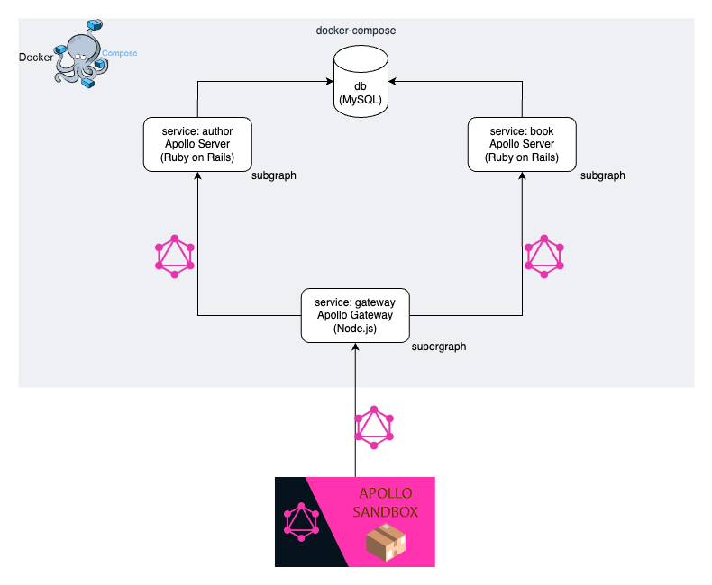

# graphql-federation

GraphQL Federationのサンプルアプリ

## version
### Apollo Gateway
- node.js: 16.20.0

### Apollo Server
- ruby: 3.1
- rails: 6.1

## 起動
```bash
docker-compose up -d
```

## 削除
```bash
docker-compose down
```

## GraphQL Sandbox

https://studio.apollographql.com/sandbox/explorer

### query

```
query {
  books {
    id
    title
    author {
      id
      name
    }
  }
}
```


## 構成

